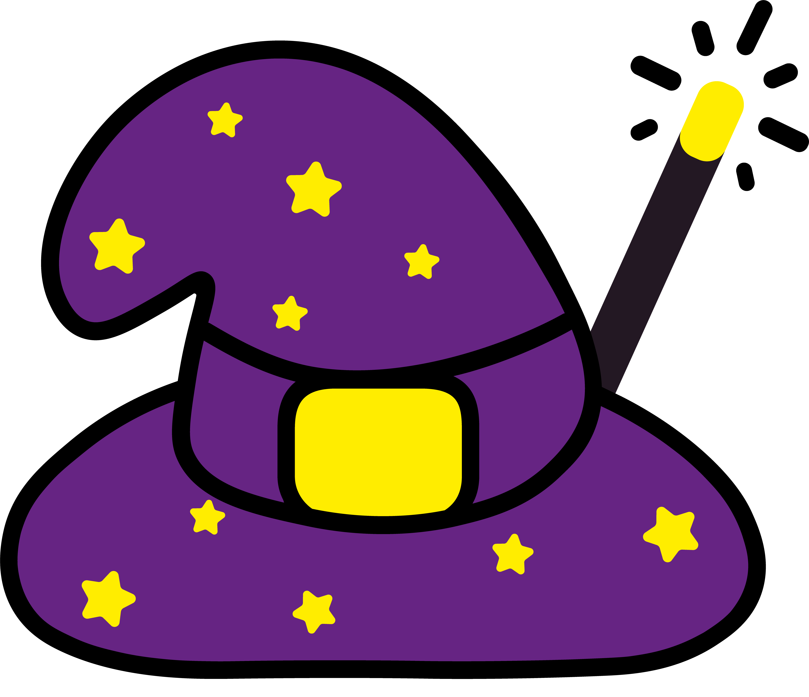

<h5 align="center">
   
  <b>Super Kids</b> ✍🏻
</h5>

  

## 👀 Overview
> Take a look at the [PIBITI Relatório Final - Planejamento e desenvolvimento de um Serious Games para educação básica.pdf](https://github.com/pferreirafabricio/super-kids-article/blob/main/PIBITI%20Relat%C3%B3rio%20Final%20-%20Planejamento%20e%20desenvolvimento%20de%20um%20Serious%20Games%20para%20educa%C3%A7%C3%A3o%20b%C3%A1sica.pdf) file

## :open_book: About 
Super Kids has as its main objective the education of children inserted in the early childhood education stage and in elementary school I, using as a tool for this an educational virtual game, based on official guiding documents.

## :bricks: This project was built with: 
- [Overleaf](https://www.overleaf.com/)

## :handshake: Contributors
 - [Fabrício Pinto Ferreira](https://github.com/pferreirafabricio)
 - [Kleber de Oliveira Andrade](https://github.com/kleberandrade)
 - [José João Bernardino da Silva Júnior](https://github.com/josejoaobsjunior)

## :page_with_curl:	License
This project is under the MIT license. Take a look at the [LICENSE](LICENSE.md) file for more details.
